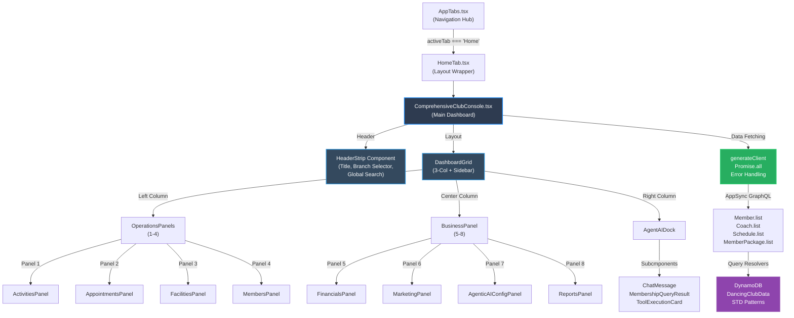

# Design Document: Comprehensive Club Console

## Overview

The Comprehensive Club Console is a high-density, real-time enterprise dashboard that transforms the empty Home tab into a unified command center for dance club administrators. It displays live data from DynamoDB (Members, Coaches, Schedules, MemberPackages, Bookings, Claims) across eight interconnected panels organized in a 3-column grid layout plus a right sidebar Agent AI dock. The console integrates operational data (activities, appointments, facilities, members), financial KPIs, marketing metrics, and agentic AI configuration into a single immersive workspace, enabling at-a-glance visibility into club operations and WhatsApp agent capabilities.

---

## Architecture



### Data Flow Pattern

1. **Initialization** → Component mounts, generates AppSync client
2. **Parallel Fetch** → Promise.all([Member.list(), Coach.list(), Schedule.list(), MemberPackage.list()])
3. **Loading State** → Skeleton loaders in all panels during fetch
4. **Data Transformation** → Raw query results → panel-specific aggregations (KPIs, grid rows, filters)
5. **Render** → All 8 panels + sidebar populated with live data
6. **Subscription Ready** → Real-time updates via AppSync subscriptions (future phase)

### Failover & Error Handling

- Each panel catches query errors independently (Error Boundary at panel level)
- Failed queries show error card with retry button
- Partial data loads gracefully (e.g., Members load but Coaches fail → show Members normally)
- Network timeout → retry after 3 seconds (configurable)

---

## Components and Interfaces

### 1. ComprehensiveClubConsole (Main Container)

**File**: `src/components/home/ComprehensiveClubConsole.tsx`

**Purpose**: Root dashboard component orchestrating all panels, data fetching, and layout.

**Props Interface**:
```typescript
interface ComprehensiveClubConsoleProps {
  // No required props; all state managed internally
  onAgentMessage?: (message: AgentMessage) => void; // Future: agent webhook integration
}

interface AgentMessage {
  id: string;
  memberId: string;
  intent: 'BOOK_COACH' | 'PAY_PACKAGE' | 'POSTPONE_SESSION' | 'QUERY_MEMBERSHIP';
  timestamp: Date;
  status: 'pending' | 'executing' | 'complete' | 'error';
}
```

**Responsibilities**:
- Orchestrate data fetching via generateClient() + Promise.all
- Manage global loading/error state
- Render HeaderStrip, 3-column grid, Agent AI dock
- Pass aggregated data to child panels
- Handle branch/club selector changes

### 2. HeaderStrip Component

**File**: `src/components/home/components/HeaderStrip.tsx`

**Purpose**: Navigation bar with title, branch dropdown, and global search.

**Props Interface**:
```typescript
interface HeaderStripProps {
  selectedClubId: string;
  clubs: Club[];
  onClubChange: (clubId: string) => void;
  onSearch: (query: string) => void;
}

interface Club {
  clubId: string;
  name: string;
  location: string;
}
```

**HTML Structure**:
```
HeaderStrip
├─ TitleSection
│  └─ Heading("VidaBaile Comprehensive Console")
├─ BranchSelector
│  └─ Select dropdown [La Vida Main, Branch 2, Branch 3...]
└─ GlobalSearch
   └─ SearchInput (filters across all panels)
```

### 3. Panel Components (1-8)

#### Panel 1: ActivitiesPanel

**File**: `src/components/home/panels/ActivitiesPanel.tsx`

**Purpose**: Weekly timetable grid from Schedule data.

**Data Shape**:
```typescript
interface ActivitiesData {
  schedules: Schedule[];
}

interface Schedule {
  scheduleId: string;
  date: string;
  startTime: string;
  endTime: string;
  activityType: string;
  capacity: number;
  coachId: string;
  status: 'SCHEDULED' | 'CANCELLED' | 'COMPLETED';
}
```

**UI Layout**:
- Title: "Weekly Activities"
- 7 columns (Mon-Sun), rows by time slot (06:00-22:00)
- Each cell: activity badge with type color, start time, capacity, status indicator
- Hover: tooltip with coach name, full description
- Compact: 5px padding, 8px font

#### Panel 2: AppointmentsPanel

**File**: `src/components/home/panels/AppointmentsPanel.tsx`

**Purpose**: Trainer grid from Coach data.

**Data Shape**:
```typescript
interface AppointmentsData {
  coaches: Coach[];
}

interface Coach {
  coachId: string;
  name: string;
  specialty: string;
  status: 'ACTIVE' | 'INACTIVE' | 'SUSPENDED';
  phone?: string;
}
```

**UI Layout**:
- Title: "Coaches & Trainers"
- Compact grid: name | specialty | status badge | phone link
- Sortable columns (name, specialty)
- Status colors: green (ACTIVE), gray (INACTIVE), red (SUSPENDED)
- Max rows: 10 (scrollable)

#### Panel 3: FacilitiesPanel

**File**: `src/components/home/panels/FacilitiesPanel.tsx`

**Purpose**: Multi-branch room layout (static + real-time occupancy).

**Data Shape**:
```typescript
interface FacilitiesData {
  rooms: Room[];
  currentBookings: Booking[];
}

interface Room {
  facilityId: string;
  name: string;
  capacity: number;
  branch: string;
}
```

**UI Layout**:
- Title: "Facilities & Rooms"
- Static layout: 3 halls (La Vida Hall, Hall 2, Hall 3)
- Each hall box: name | capacity | live occupancy % | color indicator
- Occupancy calculation: count active bookings for current hour ÷ capacity
- Color scale: green (< 50%), yellow (50-80%), red (80%+)

#### Panel 4: MembersPanel

**File**: `src/components/home/panels/MembersPanel.tsx`

**Purpose**: Compact member table from Member data.

**Data Shape**:
```typescript
interface MembersData {
  members: Member[];
}

interface Member {
  memberId: string;
  name: string;
  phone: string;
  tier: 'STANDARD' | 'SILVER' | 'GOLD' | 'PLATINUM';
  status: 'ACTIVE' | 'INACTIVE' | 'SUSPENDED';
}
```

**UI Layout**:
- Title: "Active Members"
- Columns: name | phone | tier (badge) | status (icon) | last booking
- Sort: by name or tier
- Filter: show ACTIVE only by default, toggle to show all
- Max rows: 15 (scrollable)
- Row click: deep-link to CRM tab for detailed member view

#### Panel 5: FinancialsPanel

**File**: `src/components/home/panels/FinancialsPanel.tsx`

**Purpose**: KPI boxes calculating active MemberPackages.

**Data Shape**:
```typescript
interface FinancialsData {
  memberPackages: MemberPackage[];
}

interface MemberPackage {
  packageId: string;
  packageType: string;
  totalCredits: number;
  remainingCredits: number;
  price: number;
  status: 'ACTIVE' | 'EXPIRED' | 'SUSPENDED' | 'EXHAUSTED';
}
```

**KPI Boxes**:
1. **Total Revenue** — Sum of price where status='ACTIVE'
2. **Active Packages** — Count where status='ACTIVE'
3. **Avg Credits Remaining** — Mean of remainingCredits across all
4. **Expiring This Week** — Count where validUntil is within 7 days

**UI Layout**:
- 4 KPI boxes arranged 2x2 or 1x4 (responsive)
- Each box: metric name | large number | small trend arrow (↑↓ or →) | color

#### Panel 6: MarketingPanel

**File**: `src/components/home/panels/MarketingPanel.tsx`

**Purpose**: Static WhatsApp broadcast UI with reach, open rates.

**Data Shape** (Static for now):
```typescript
interface MarketingData {
  broadcastCampaigns?: BroadcastCampaign[];
}

interface BroadcastCampaign {
  campaignId: string;
  message: string;
  sentAt: Date;
  reach: number;
  openRate: number;
}
```

**UI Layout**:
- Title: "Marketing & Broadcasts"
- Campaign cards: message preview | sent time | reach count | open rate %
- Primary action: "New Broadcast" button
- Click "New Broadcast" → modal or side-drawer composer
- Show recent 5 campaigns

#### Panel 7: AgenticAIConfigPanel

**File**: `src/components/home/panels/AgenticAIConfigPanel.tsx`

**Purpose**: Visual readout of 4 supported intents + current config.

**Data Shape**:
```typescript
interface AgenticAIConfigData {
  supportedIntents: Intent[];
  agentStatus: 'online' | 'offline' | 'error';
}

interface Intent {
  name: 'BOOK_COACH' | 'PAY_PACKAGE' | 'POSTPONE_SESSION' | 'QUERY_MEMBERSHIP';
  description: string;
  enabled: boolean;
  toolsAvailable: string[];
}
```

**UI Layout**:
- Title: "Agentic AI Configuration"
- Status badge: online (green) | offline (gray) | error (red)
- 4 intent cards arranged 2x2:
  - Card: intent name | description | enabled toggle | tool list
- Edit button → Settings tab for advanced config

#### Panel 8: ReportsPanel

**File**: `src/components/home/panels/ReportsPanel.tsx`

**Purpose**: KPI widgets (Attendance, Retention).

**Data Shape**:
```typescript
interface ReportsData {
  bookings: Booking[];
  members: Member[];
}

interface AttendanceMetric {
  label: string;
  value: number;
  period: string;
}
```

**KPI Widgets**:
1. **Attendance Rate** — (bookings confirmed this week / scheduled) × 100
2. **Retention Rate** — (active members this month / total members) × 100
3. **Avg Attendance per Member** — total bookings ÷ total members
4. **Popular Activities** — top 3 activity types by booking count

**UI Layout**:
- Widget cards with metric name | percentage | trend | period
- Sparkline charts (simple CSS or SVG) for trend visualization

### 4. Agent AI Dock (Right Sidebar)

**File**: `src/components/home/dock/AgentAIDock.tsx`

**Purpose**: Simulated WhatsApp chat + MCP tool execution + Bedrock response display.

**Props Interface**:
```typescript
interface AgentAIDockProps {
  onMessageSend?: (message: string) => Promise<void>;
}

interface ChatMessage {
  id: string;
  sender: 'member' | 'agent';
  type: 'text' | 'membership_query_result' | 'tool_execution' | 'error';
  content: string;
  timestamp: Date;
  metadata?: Record<string, unknown>;
}
```

**UI Layout**:
- Header: "Agent AI Dock" | status badge | minimize button
- Message thread: scrollable container with last 20 messages
- Message bubble format:
  - **Member message**: left-aligned, speech bubble, light background
  - **Agent response**: right-aligned, darker background
  - **Tool execution**: centered card with MCP tool info + execution status
  - **Membership query result**: inline table/card within message bubble
- Input area: text input + send button (or WhatsApp-like "→" icon)
- Example conversation:
  ```
  Member: "Book me a salsa class tomorrow"
  [System shows: intent classification = BOOK_COACH, extracting parameters...]
  [Tool Execution Card: MCP tool = "bookCoach", status = executing]
  Agent: "Great! I've booked you for Salsa Intermediate at 18:30 with Coach Maria. 
           Your booking ID is BK-2024-1234."
  ```

---

## CSS Grid Layout Specification

### 3-Column + Sidebar Layout

**File**: `src/components/home/ComprehensiveClubConsole.css`

```css
.console-container {
  display: grid;
  grid-template-areas:
    "header header header header"
    "left center right dock";
  grid-template-columns: 1fr 1fr 1fr minmax(320px, 350px);
  grid-template-rows: auto 1fr;
  gap: 12px;
  padding: 12px;
  height: 100vh;
  overflow: hidden;
  background: #f5f5f5;
}

/* Header spans all columns */
.header-strip {
  grid-area: header;
  height: 60px;
  background: white;
  border-bottom: 1px solid #e0e0e0;
  padding: 0 16px;
  display: flex;
  align-items: center;
  gap: 20px;
}

/* Left column: Panels 1-4 */
.operations-column {
  grid-area: left;
  display: flex;
  flex-direction: column;
  gap: 12px;
  overflow-y: auto;
}

/* Center column: Panels 5-8 */
.business-column {
  grid-area: center;
  display: flex;
  flex-direction: column;
  gap: 12px;
  overflow-y: auto;
}

/* Right column: Agent AI Dock */
.agent-dock {
  grid-area: dock;
  display: flex;
  flex-direction: column;
  overflow-y: auto;
  background: white;
  border: 1px solid #e0e0e0;
  border-radius: 4px;
}

/* Individual panel styling */
.panel {
  background: white;
  border: 1px solid #e0e0e0;
  border-radius: 4px;
  padding: 12px;
  min-height: 180px;
  box-shadow: 0 1px 2px rgba(0,0,0,0.05);
  overflow: hidden;
  display: flex;
  flex-direction: column;
}

.panel-title {
  font-size: 13px;
  font-weight: 600;
  margin-bottom: 8px;
  color: #1a1a1a;
  text-transform: uppercase;
  letter-spacing: 0.5px;
}

.panel-content {
  flex: 1;
  overflow-y: auto;
  font-size: 12px;
}

/* Responsive Breakpoints */
@media (max-width: 1400px) {
  .console-container {
    grid-template-columns: 1fr 1fr 1fr;
    grid-template-areas:
      "header header header"
      "left center right";
  }
  
  .agent-dock {
    min-width: 280px;
  }
}

@media (max-width: 1024px) {
  .console-container {
    grid-template-columns: 1fr 1fr;
    grid-template-areas:
      "header header"
      "left center";
    padding: 8px;
    gap: 8px;
  }
  
  .agent-dock {
    display: none; /* Hide dock on tablet */
  }
}

@media (max-width: 640px) {
  .console-container {
    grid-template-columns: 1fr;
    grid-template-areas:
      "header"
      "left"
      "center";
    height: auto;
  }
  
  .operations-column,
  .business-column {
    overflow-y: visible;
  }
  
  .panel {
    min-height: 160px;
  }
}
```

### Column Widths & Gap

- **Left column (Operations)**: ~25% of available width
- **Center column (Business)**: ~28% of available width
- **Right column (Dock)**: ~22% of available width (or 320px fixed minimum)
- **Gap**: 12px between columns, 12px between rows
- **Panel min-height**: 180px on desktop, 160px on mobile
- **Panel max-height**: auto-grow with vertical overflow

---

## Micro-Component Library

### Badge Component

**File**: `src/components/home/components/Badge.tsx`

```typescript
interface BadgeProps {
  variant: 'default' | 'success' | 'warning' | 'danger' | 'info';
  text: string;
  size?: 'small' | 'medium';
}

function Badge({ variant, text, size = 'small' }: BadgeProps) {
  const colorMap = {
    default: { bg: '#f0f0f0', fg: '#1a1a1a' },
    success: { bg: '#d4edda', fg: '#155724' },
    warning: { bg: '#fff3cd', fg: '#856404' },
    danger: { bg: '#f8d7da', fg: '#721c24' },
    info: { bg: '#d1ecf1', fg: '#0c5460' },
  };
  
  const colors = colorMap[variant];
  const padding = size === 'small' ? '2px 6px' : '4px 8px';
  const fontSize = size === 'small' ? '11px' : '12px';
  
  return (
    <span
      style={{
        backgroundColor: colors.bg,
        color: colors.fg,
        padding,
        fontSize,
        borderRadius: '3px',
        fontWeight: 600,
        display: 'inline-block',
        whiteSpace: 'nowrap',
      }}
    >
      {text}
    </span>
  );
}
```

### Pill Component

**File**: `src/components/home/components/Pill.tsx`

```typescript
interface PillProps {
  icon?: React.ReactNode;
  label: string;
  value: string | number;
  color?: 'primary' | 'success' | 'warning' | 'danger';
  size?: 'small' | 'medium';
}

function Pill({ icon, label, value, color = 'primary', size = 'small' }: PillProps) {
  const sizeStyles = size === 'small' 
    ? { padding: '4px 8px', fontSize: '11px' }
    : { padding: '6px 12px', fontSize: '12px' };
  
  return (
    <div
      style={{
        display: 'flex',
        alignItems: 'center',
        gap: '4px',
        backgroundColor: '#f5f5f5',
        borderRadius: '16px',
        border: '1px solid #e0e0e0',
        ...sizeStyles,
      }}
    >
      {icon && <span style={{ fontSize: '12px' }}>{icon}</span>}
      <span style={{ color: '#666', fontWeight: 500 }}>{label}:</span>
      <span style={{ color: '#1a1a1a', fontWeight: 600 }}>{value}</span>
    </div>
  );
}
```

### MiniTable Component

**File**: `src/components/home/components/MiniTable.tsx`

```typescript
interface MiniTableProps {
  columns: Array<{ key: string; header: string; width?: string; render?: (val: any) => React.ReactNode }>;
  data: Array<Record<string, any>>;
  maxRows?: number;
  sortBy?: string;
  onRowClick?: (row: Record<string, any>) => void;
}

function MiniTable({ columns, data, maxRows = 10, sortBy, onRowClick }: MiniTableProps) {
  const rows = data.slice(0, maxRows);
  
  return (
    <table style={{ width: '100%', borderCollapse: 'collapse', fontSize: '12px' }}>
      <thead>
        <tr style={{ borderBottom: '1px solid #e0e0e0', backgroundColor: '#fafafa' }}>
          {columns.map((col) => (
            <th
              key={col.key}
              style={{
                textAlign: 'left',
                padding: '6px 4px',
                fontWeight: 600,
                color: '#666',
                width: col.width,
              }}
            >
              {col.header}
            </th>
          ))}
        </tr>
      </thead>
      <tbody>
        {rows.map((row, idx) => (
          <tr
            key={idx}
            onClick={() => onRowClick?.(row)}
            style={{
              borderBottom: '1px solid #f0f0f0',
              cursor: onRowClick ? 'pointer' : 'default',
              ':hover': onRowClick ? { backgroundColor: '#fafafa' } : {},
            }}
          >
            {columns.map((col) => (
              <td key={col.key} style={{ padding: '6px 4px', color: '#1a1a1a' }}>
                {col.render ? col.render(row[col.key]) : row[col.key]}
              </td>
            ))}
          </tr>
        ))}
      </tbody>
    </table>
  );
}
```

### KPIBox Component

**File**: `src/components/home/components/KPIBox.tsx`

```typescript
interface KPIBoxProps {
  title: string;
  value: number | string;
  unit?: string;
  trend?: 'up' | 'down' | 'neutral';
  trendPercent?: number;
  icon?: React.ReactNode;
  size?: 'small' | 'medium';
}

function KPIBox({ title, value, unit, trend, trendPercent, icon, size = 'medium' }: KPIBoxProps) {
  const sizeStyles = size === 'small'
    ? { padding: '12px', minHeight: '80px' }
    : { padding: '16px', minHeight: '100px' };
  
  const trendColor = trend === 'up' ? '#27ae60' : trend === 'down' ? '#e74c3c' : '#95a5a6';
  const trendArrow = trend === 'up' ? '↑' : trend === 'down' ? '↓' : '→';
  
  return (
    <div
      style={{
        backgroundColor: '#white',
        border: '1px solid #e0e0e0',
        borderRadius: '6px',
        ...sizeStyles,
        display: 'flex',
        flexDirection: 'column',
        justifyContent: 'space-between',
      }}
    >
      <div style={{ fontSize: '11px', color: '#666', fontWeight: 600, textTransform: 'uppercase' }}>
        {title}
      </div>
      <div style={{ display: 'flex', alignItems: 'flex-end', justifyContent: 'space-between' }}>
        <div>
          <div style={{ fontSize: '20px', fontWeight: 700, color: '#1a1a1a' }}>
            {value}
            {unit && <span style={{ fontSize: '14px', color: '#999', marginLeft: '4px' }}>{unit}</span>}
          </div>
        </div>
        {trend && (
          <div style={{ fontSize: '12px', color: trendColor, fontWeight: 600 }}>
            {trendArrow} {trendPercent && `${trendPercent}%`}
          </div>
        )}
      </div>
    </div>
  );
}
```

### SkeletonLoader Component

**File**: `src/components/home/components/SkeletonLoader.tsx`

```typescript
interface SkeletonLoaderProps {
  lines?: number;
  width?: string;
}

function SkeletonLoader({ lines = 3, width = '100%' }: SkeletonLoaderProps) {
  return (
    <div style={{ width, display: 'flex', flexDirection: 'column', gap: '8px' }}>
      {Array.from({ length: lines }).map((_, i) => (
        <div
          key={i}
          style={{
            height: '12px',
            backgroundColor: '#e0e0e0',
            borderRadius: '3px',
            animation: 'pulse 1.5s ease-in-out infinite',
          }}
        />
      ))}
    </div>
  );
}
```

---

## Data Fetching Pattern

### Promise.all + Error Handling

**File**: `src/components/home/hooks/useComprehensiveData.ts`

```typescript
import { generateClient } from 'aws-amplify/data';
import type { Schema } from '../../../amplify/data/resource';

interface ComprehensiveData {
  members: Schema['Member'][];
  coaches: Schema['Coach'][];
  schedules: Schema['Schedule'][];
  memberPackages: Schema['MemberPackage'][];
  bookings: Schema['Booking'][];
}

interface UseComprehensiveDataReturn {
  data: Partial<ComprehensiveData> | null;
  loading: boolean;
  error: Error | null;
  refetch: () => Promise<void>;
}

export function useComprehensiveData(clubId: string): UseComprehensiveDataReturn {
  const [data, setData] = useState<Partial<ComprehensiveData> | null>(null);
  const [loading, setLoading] = useState(true);
  const [error, setError] = useState<Error | null>(null);

  const client = generateClient<Schema>();

  const fetchData = async () => {
    setLoading(true);
    setError(null);

    try {
      const [membersResult, coachesResult, schedulesResult, packagesResult] = await Promise.all([
        client.models.Member.list({ filter: { clubId: { eq: clubId } } }),
        client.models.Coach.list(),
        client.models.Schedule.list(),
        client.models.MemberPackage.list(),
      ]);

      setData({
        members: membersResult.data || [],
        coaches: coachesResult.data || [],
        schedules: schedulesResult.data || [],
        memberPackages: packagesResult.data || [],
      });
    } catch (err) {
      setError(err instanceof Error ? err : new Error('Unknown error'));
    } finally {
      setLoading(false);
    }
  };

  useEffect(() => {
    fetchData();
  }, [clubId]);

  return { data, loading, error, refetch: fetchData };
}
```

### Panel-Level Error Boundary

Each panel wraps its content in a try-catch or Error Boundary:

```typescript
interface PanelErrorBoundaryProps {
  panelName: string;
  children: React.ReactNode;
  fallback?: React.ReactNode;
}

function PanelErrorBoundary({ panelName, children, fallback }: PanelErrorBoundaryProps) {
  const [error, setError] = useState<Error | null>(null);

  if (error) {
    return (
      <div style={{ padding: '12px', color: '#e74c3c', fontSize: '12px' }}>
        {fallback || (
          <>
            <strong>Error in {panelName}</strong>
            <p>{error.message}</p>
            <button onClick={() => setError(null)} style={{ fontSize: '11px', padding: '4px 8px' }}>
              Retry
            </button>
          </>
        )}
      </div>
    );
  }

  try {
    return <>{children}</>;
  } catch (err) {
    setError(err instanceof Error ? err : new Error('Unknown error'));
    return null;
  }
}
```

---

## Agent AI Dock UI Specification

### Simulated WhatsApp Chat Interface

**File**: `src/components/home/dock/AgentAIDock.tsx`

**Message Types**:

1. **User Message** (left-aligned):
```typescript
interface UserMessage {
  type: 'user';
  text: string;
  timestamp: Date;
}
```

2. **Agent Response** (right-aligned):
```typescript
interface AgentResponse {
  type: 'agent';
  text: string;
  timestamp: Date;
}
```

3. **Tool Execution Card** (centered):
```typescript
interface ToolExecutionMessage {
  type: 'tool_execution';
  toolName: string;
  parameters: Record<string, any>;
  status: 'pending' | 'executing' | 'complete' | 'error';
  result?: any;
  timestamp: Date;
}
```

4. **Membership Query Result** (inline card):
```typescript
interface MembershipQueryResult {
  type: 'membership_query';
  memberId: string;
  memberName: string;
  tier: string;
  activePackages: number;
  nextBooking?: { date: string; activityType: string };
  timestamp: Date;
}
```

**UI Layout**:
```
┌─────────────────────────────────────┐
│  Agent AI Dock  [●●●] [-] [X]       │  ← Header with status badge
├─────────────────────────────────────┤
│                                     │
│  Yesterday 2:30 PM                  │
│                                     │
│  ┌─────────────────────────────┐    │
│  │ Hi, I'd like to book a       │    │  ← User message (left)
│  │ salsa class for tomorrow.    │    │
│  └─────────────────────────────┘    │
│                                     │
│         [⚙️ Tool: bookCoach]         │  ← Tool execution card (center)
│         Classifying intent...       │
│         Status: executing...        │
│                                     │
│                  ┌──────────────┐   │
│                  │ Perfect! I   │   │  ← Agent response (right)
│                  │ found an     │   │
│                  │ available... │   │
│                  └──────────────┘   │
│                                     │
├─────────────────────────────────────┤
│ [📝 Type a message...] [→]          │  ← Input area
└─────────────────────────────────────┘
```

**CSS for Chat Styling**:
```css
.agent-dock {
  display: flex;
  flex-direction: column;
  height: 100%;
  background: #fff;
  border: 1px solid #e0e0e0;
  border-radius: 4px;
  overflow: hidden;
}

.dock-header {
  padding: 12px;
  background: #2e3b50;
  color: white;
  font-size: 12px;
  font-weight: 600;
  display: flex;
  justify-content: space-between;
  align-items: center;
}

.dock-messages {
  flex: 1;
  overflow-y: auto;
  padding: 12px;
  display: flex;
  flex-direction: column;
  gap: 12px;
}

.message {
  display: flex;
  margin-bottom: 8px;
}

.message.user {
  justify-content: flex-start;
}

.message.agent {
  justify-content: flex-end;
}

.message-bubble {
  max-width: 85%;
  padding: 8px 12px;
  border-radius: 8px;
  font-size: 12px;
  line-height: 1.4;
}

.message.user .message-bubble {
  background: #e3f2fd;
  color: #1a1a1a;
}

.message.agent .message-bubble {
  background: #2e3b50;
  color: white;
}

.tool-execution-card {
  background: #fafafa;
  border: 1px solid #e0e0e0;
  border-radius: 6px;
  padding: 8px;
  font-size: 11px;
  text-align: center;
  margin: 4px 0;
  color: #666;
}

.tool-execution-card.executing {
  border-left: 3px solid #3498db;
}

.tool-execution-card.complete {
  border-left: 3px solid #27ae60;
}

.tool-execution-card.error {
  border-left: 3px solid #e74c3c;
}

.dock-input {
  border-top: 1px solid #e0e0e0;
  padding: 8px;
  display: flex;
  gap: 6px;
  align-items: center;
}

.dock-input input {
  flex: 1;
  border: 1px solid #e0e0e0;
  border-radius: 4px;
  padding: 6px 8px;
  font-size: 12px;
}

.dock-input button {
  background: #2e3b50;
  color: white;
  border: none;
  border-radius: 4px;
  padding: 6px 10px;
  cursor: pointer;
  font-size: 12px;
}
```

---

## Integration Points

### 1. Update AppTabs.tsx

No changes needed — HomeTab is already imported and rendered.

### 2. Update HomeTab.tsx

**File**: `src/components/home/HomeTab.tsx`

```typescript
import { View } from '@aws-amplify/ui-react';
import { ComprehensiveClubConsole } from './ComprehensiveClubConsole';

export function HomeTab() {
  return (
    <View as="main" padding="0">
      <ComprehensiveClubConsole />
    </View>
  );
}
```

### 3. Create ComprehensiveClubConsole.tsx

**File**: `src/components/home/ComprehensiveClubConsole.tsx`

```typescript
import { useEffect, useState } from 'react';
import { View } from '@aws-amplify/ui-react';
import { useComprehensiveData } from './hooks/useComprehensiveData';
import { HeaderStrip } from './components/HeaderStrip';
import { ActivitiesPanel } from './panels/ActivitiesPanel';
import { AppointmentsPanel } from './panels/AppointmentsPanel';
import { FacilitiesPanel } from './panels/FacilitiesPanel';
import { MembersPanel } from './panels/MembersPanel';
import { FinancialsPanel } from './panels/FinancialsPanel';
import { MarketingPanel } from './panels/MarketingPanel';
import { AgenticAIConfigPanel } from './panels/AgenticAIConfigPanel';
import { ReportsPanel } from './panels/ReportsPanel';
import { AgentAIDock } from './dock/AgentAIDock';
import './ComprehensiveClubConsole.css';

export function ComprehensiveClubConsole() {
  const [selectedClubId, setSelectedClubId] = useState('club-1');
  const { data, loading, error } = useComprehensiveData(selectedClubId);

  return (
    <View className="console-container">
      <HeaderStrip
        selectedClubId={selectedClubId}
        clubs={[{ clubId: 'club-1', name: 'La Vida Main', location: 'Downtown' }]}
        onClubChange={setSelectedClubId}
        onSearch={(query) => console.log('Search:', query)}
      />

      <div className="operations-column">
        <ActivitiesPanel schedules={data?.schedules || []} loading={loading} error={error} />
        <AppointmentsPanel coaches={data?.coaches || []} loading={loading} error={error} />
        <FacilitiesPanel bookings={data?.bookings || []} loading={loading} error={error} />
        <MembersPanel members={data?.members || []} loading={loading} error={error} />
      </div>

      <div className="business-column">
        <FinancialsPanel packages={data?.memberPackages || []} loading={loading} error={error} />
        <MarketingPanel loading={loading} error={error} />
        <AgenticAIConfigPanel loading={loading} error={error} />
        <ReportsPanel bookings={data?.bookings || []} members={data?.members || []} loading={loading} error={error} />
      </div>

      <AgentAIDock />
    </View>
  );
}
```

---

## Correctness Properties

*A property is a universal characteristic that should hold true for all valid data and user interactions. Each property below is formalized as a universal quantification ("for all" or "for any") and is mapped to specific requirements it validates.*

### Property 1: Member Data Completeness

**Statement**: For any Member records in DynamoDB, all members must be rendered in the Members Panel (up to the display limit of 15 rows) without omission.

**Formal Property**:
```
∀ membersList ∈ query(Member.list):
  let displayedMembers = MembersPanel.renderedRows
  let visibleCount = min(length(membersList), 15)
  displayedMembers.length ≥ visibleCount ∧
  ∀ member ∈ membersList[0..visibleCount]:
    member ∈ displayedMembers
```

**Validates: Requirements 2.1, 2.5**

---

### Property 2: Member Field Rendering

**Statement**: For any Member record, all required fields (name, phone, tier, status) must be rendered correctly in their assigned column positions.

**Formal Property**:
```
∀ member ∈ MembersPanel.data:
  hasValue(member.name) ∧ 
  hasValue(member.phone) ∧ 
  hasValue(member.tier ∈ {STANDARD, SILVER, GOLD, PLATINUM}) ∧
  hasValue(member.status ∈ {ACTIVE, INACTIVE, SUSPENDED}) ∧
  (∀ field ∈ {name, phone, tier, status}: isVisible(member.field))
```

**Validates: Requirements 2.2**

---

### Property 3: Member Tier Badge Color Mapping

**Statement**: For any Member with any tier, the rendered badge must display the correct color corresponding to that tier.

**Formal Property**:
```
∀ member ∈ Members:
  (member.tier = STANDARD ⟹ badge.color = gray) ∧
  (member.tier = SILVER ⟹ badge.color = lightBlue) ∧
  (member.tier = GOLD ⟹ badge.color = gold) ∧
  (member.tier = PLATINUM ⟹ badge.color = purple)
```

**Validates: Requirements 2.3**

---

### Property 4: Member Status Icon Accuracy

**Statement**: For any Member with any status, the correct status icon (checkmark/dash/X) must be rendered.

**Formal Property**:
```
∀ member ∈ Members:
  (member.status = ACTIVE ⟹ icon = ✓) ∧
  (member.status = INACTIVE ⟹ icon = −) ∧
  (member.status = SUSPENDED ⟹ icon = ✕)
```

**Validates: Requirements 2.4**

---

### Property 5: Activity Schedule Grid Completeness

**Statement**: For any set of Schedule records, all activities must be rendered in the timetable grid at their correct time slots without omission.

**Formal Property**:
```
∀ schedulesList ∈ query(Schedule.list):
  ∀ schedule ∈ schedulesList:
    ∃ cell ∈ ActivitiesPanel.grid:
      cell.date = schedule.date ∧
      cell.timeSlot = schedule.startTime ∧
      cell.content contains schedule.activityType
```

**Validates: Requirements 3.1, 3.3**

---

### Property 6: Coach Data Completeness

**Statement**: For any Coach records in DynamoDB, all coaches must be rendered in the Appointments Panel (up to 10 rows) with all required columns (name, specialty, status, phone).

**Formal Property**:
```
∀ coachesList ∈ query(Coach.list):
  let displayedCoaches = AppointmentsPanel.renderedRows
  let visibleCount = min(length(coachesList), 10)
  ∀ coach ∈ coachesList[0..visibleCount]:
    coach ∈ displayedCoaches ∧
    (∀ column ∈ {name, specialty, status, phone}: hasColumn(coach, column))
```

**Validates: Requirements 4.1, 4.2**

---

### Property 7: Coach Status Badge Color Correctness

**Statement**: For any Coach with any status, the status badge must display the correct color.

**Formal Property**:
```
∀ coach ∈ Coaches:
  (coach.status = ACTIVE ⟹ badge.color = green) ∧
  (coach.status = INACTIVE ⟹ badge.color = gray) ∧
  (coach.status = SUSPENDED ⟹ badge.color = red)
```

**Validates: Requirements 4.3**

---

### Property 8: Facility Occupancy Calculation Correctness

**Statement**: For any facility and any current hour, the displayed occupancy percentage must match the formula: (active bookings in current hour ÷ capacity) × 100.

**Formal Property**:
```
∀ facility ∈ Facilities:
  ∀ currentHour ∈ [now, now+1hour):
    let activeCount = count(booking ∈ Bookings: booking.facility = facility ∧ booking.timeOverlapsWith(currentHour))
    let occupancyPercent = (activeCount ÷ facility.capacity) × 100
    displayed.occupancyPercent = occupancyPercent
```

**Validates: Requirements 5.4**

---

### Property 9: Occupancy Color Scale Mapping

**Statement**: For any occupancy percentage, the displayed color must correctly map to the occupancy range (green < 50%, yellow 50-80%, red ≥ 80%).

**Formal Property**:
```
∀ occupancyPercent ∈ [0, 100]:
  (occupancyPercent < 50 ⟹ color = green) ∧
  (50 ≤ occupancyPercent ≤ 80 ⟹ color = yellow) ∧
  (occupancyPercent > 80 ⟹ color = red)
```

**Validates: Requirements 5.5**

---

### Property 10: Total Revenue KPI Calculation Accuracy

**Statement**: For any set of MemberPackage records, the displayed Total Revenue must exactly equal the sum of prices for all packages with status = ACTIVE.

**Formal Property**:
```
∀ packagesList ∈ query(MemberPackage.list):
  let activePackages = filter(packagesList, pkg ⟹ pkg.status = ACTIVE)
  let expectedRevenue = sum(pkg.price for pkg ∈ activePackages)
  FinancialsPanel.TotalRevenueKPI.value = expectedRevenue
```

**Validates: Requirements 6.2**

---

### Property 11: Active Packages Count Accuracy

**Statement**: For any set of MemberPackage records, the displayed Active Packages count must exactly equal the count of packages with status = ACTIVE.

**Formal Property**:
```
∀ packagesList ∈ query(MemberPackage.list):
  let activeCount = count(pkg ∈ packagesList where pkg.status = ACTIVE)
  FinancialsPanel.ActivePackagesKPI.value = activeCount
```

**Validates: Requirements 6.3**

---

### Property 12: Average Credits Remaining Calculation

**Statement**: For any set of MemberPackage records, the displayed average credits must equal the mean of remainingCredits across all packages.

**Formal Property**:
```
∀ packagesList ∈ query(MemberPackage.list):
  let expectedAvg = mean(pkg.remainingCredits for pkg ∈ packagesList)
  FinancialsPanel.AvgCreditsKPI.value = expectedAvg
```

**Validates: Requirements 6.4**

---

### Property 13: Expiring Packages Count Accuracy

**Statement**: For any set of MemberPackage records and current date, the displayed Expiring This Week count must equal the count of packages with validUntil within the next 7 days.

**Formal Property**:
```
∀ packagesList ∈ query(MemberPackage.list):
  ∀ currentDate ∈ Date:
    let expiringCount = count(pkg ∈ packagesList where currentDate ≤ pkg.validUntil ≤ currentDate + 7days)
    FinancialsPanel.ExpiringThisWeekKPI.value = expiringCount
```

**Validates: Requirements 6.5**

---

### Property 14: Marketing Campaign List Completeness

**Statement**: For any set of broadcast campaigns, the 5 most recent campaigns (by sentAt timestamp) must be rendered in the Marketing Panel.

**Formal Property**:
```
∀ campaignsList ∈ query(BroadcastCampaign.list):
  let recentCampaigns = sort(campaignsList, by: sentAt, descending)
  let top5 = recentCampaigns[0..4]
  ∀ campaign ∈ top5:
    campaign ∈ MarketingPanel.renderedCampaigns ∧
    (∀ field ∈ {message, sentAt, reach, openRate}: hasField(campaign, field))
```

**Validates: Requirements 7.1, 7.2, 7.3**

---

### Property 15: Message Character Count Accuracy

**Statement**: For any message text in the broadcast composer, the displayed character count must exactly equal the length of the message string.

**Formal Property**:
```
∀ messageText ∈ BroadcastComposer.inputText:
  BroadcastComposer.charCountDisplay = length(messageText)
```

**Validates: Requirements 7.7**

---

### Property 16: Agent Status Badge Correct Mapping

**Statement**: For any agent operational status, the status badge must display the correct color and label.

**Formal Property**:
```
∀ agentStatus ∈ {online, offline, error}:
  (agentStatus = online ⟹ badge.color = green ∧ badge.label = "Online") ∧
  (agentStatus = offline ⟹ badge.color = gray ∧ badge.label = "Offline") ∧
  (agentStatus = error ⟹ badge.color = red ∧ badge.label = "Error")
```

**Validates: Requirements 8.2**

---

### Property 17: Agent Intent Card Display Completeness

**Statement**: For each of the 4 supported agent intents, a card must be rendered with name, description, toggle, and tool list.

**Formal Property**:
```
∀ intent ∈ {BOOK_COACH, PAY_PACKAGE, POSTPONE_SESSION, QUERY_MEMBERSHIP}:
  ∃ card ∈ AgenticAIConfigPanel.intentCards:
    card.intentName = intent ∧
    hasValue(card.description) ∧
    hasElement(card, enabledToggle) ∧
    hasField(card, toolList)
```

**Validates: Requirements 8.3, 8.4**

---

### Property 18: Attendance Rate Calculation Accuracy

**Statement**: For any set of Booking records in a given week, the displayed Attendance Rate must equal (confirmed bookings ÷ scheduled bookings) × 100.

**Formal Property**:
```
∀ bookingsList ∈ query(Booking.list):
  ∀ week ∈ [currentWeek]:
    let confirmedCount = count(booking ∈ bookingsList where booking.week = week ∧ booking.status = CONFIRMED)
    let scheduledCount = count(booking ∈ bookingsList where booking.week = week ∧ booking.status = SCHEDULED)
    let expectedRate = (confirmedCount ÷ scheduledCount) × 100
    ReportsPanel.AttendanceRateKPI.value = expectedRate
```

**Validates: Requirements 9.2**

---

### Property 19: Top Popular Activities Ranking

**Statement**: For any set of Booking records, the 4th Reports panel widget must display the top 3 activity types ranked by booking count in descending order.

**Formal Property**:
```
∀ bookingsList ∈ query(Booking.list):
  let activityCounts = groupBy(bookingsList, activityType).count()
  let top3Activities = sort(activityCounts, by: count, descending)[0..2]
  ∀ activity ∈ top3Activities:
    activity ∈ ReportsPanel.PopularActivitiesWidget ∧
    rank(activity) ∈ {1, 2, 3}
```

**Validates: Requirements 9.5**

---

### Property 20: Agent AI Dock Message History Limit

**Statement**: For any set of chat messages, the Agent AI Dock must display only the last 20 messages; older messages are not visible without scrolling.

**Formal Property**:
```
∀ messageHistory ∈ ChatMessages:
  let visibleMessages = AgentAIDock.visibleMessages
  length(visibleMessages) ≤ 20 ∧
  visibleMessages = messageHistory[−20..]  (last 20)
```

**Validates: Requirements 10.3**

---

### Property 21: Tool Execution Card Status Display

**Statement**: For any agent tool execution, a tool execution card must be displayed showing the correct status (pending, executing, complete, or error).

**Formal Property**:
```
∀ toolExecution ∈ AgentToolExecutions:
  ∃ card ∈ AgentAIDock.cards:
    card.toolName = toolExecution.toolName ∧
    card.status ∈ {pending, executing, complete, error} ∧
    card.status = toolExecution.currentStatus
```

**Validates: Requirements 10.6**

---

### Property 22: Membership Query Result Display Completeness

**Statement**: For any membership query result returned by the agent, a result card must be displayed with member name, tier, active packages count, and next booking info.

**Formal Property**:
```
∀ queryResult ∈ MembershipQueryResults:
  ∃ card ∈ AgentAIDock.resultCards:
    card.memberName = queryResult.memberName ∧
    hasValue(card.tier) ∧
    hasValue(card.activePackagesCount) ∧
    (queryResult.nextBooking ≠ null ⟹ hasValue(card.nextBookingDate ∧ card.nextBookingActivity))
```

**Validates: Requirements 10.7**

---

### Property 23: Panel Error Boundary Independence

**Statement**: For any panel that encounters a data fetch error, other panels must continue rendering their data without interruption or cascade.

**Formal Property**:
```
∀ panelA, panelB ∈ AllPanels where panelA ≠ panelB:
  error(panelA.fetch) ⟹ 
    (panelB.isRendering = true ∧ 
     panelB.data = lastKnownGoodData ∧
     ¬propagatesError(panelA, panelB))
```

**Validates: Requirements 14.4**

---

### Property 24: Skeleton Loader Display During Loading

**Statement**: For any panel in loading state, a skeleton loader must be displayed immediately (< 100ms) providing visual feedback to the user.

**Formal Property**:
```
∀ panel ∈ AllPanels:
  panel.loading = true ⟹
    (isVisible(panel.skeletonLoader) ∧
     renderTime(panel.skeletonLoader) < 100ms)
```

**Validates: Requirements 11.3**

---

### Property 25: Data Render Performance

**Statement**: For any panel, rendering of fetched data to DOM must complete within 100ms after data becomes available.

**Formal Property**:
```
∀ panel ∈ AllPanels:
  (data.fetchComplete(t) ∧ data.success = true) ⟹
    (panel.renderComplete ≤ t + 100ms)
```

**Validates: Requirements 11.4**

---

### Property 26: Error Card Display on Fetch Failure

**Statement**: For any panel whose data fetch fails, an error card must be displayed with error message, panel name, and retry button.

**Formal Property**:
```
∀ panel ∈ AllPanels:
  panel.fetch.error ⟹
    (isVisible(panel.errorCard) ∧
     hasText(panel.errorCard, panel.name) ∧
     hasButton(panel.errorCard, "Retry"))
```

**Validates: Requirements 14.2**

---

### Property 27: Club Data Scoping

**Statement**: For any selected clubId, all displayed data across all panels must be filtered to belong to that club or be club-neutral; no cross-club data leakage.

**Formal Property**:
```
∀ selectedClubId ∈ SelectedClub:
  ∀ panel ∈ AllPanels:
    ∀ dataPoint ∈ panel.displayedData:
      (hasClubIdField(dataPoint) ⟹ dataPoint.clubId = selectedClubId) ∨
      (¬hasClubIdField(dataPoint) ⟹ isClubNeutral(dataPoint))
```

**Validates: Requirements 12.4**

---

### Property 28: Global Search Filtering Across Panels

**Statement**: For any search query string, all panels must filter their displayed data to show only records matching the query (case-insensitive) across member names, phones, coaches, activities, and facilities.

**Formal Property**:
```
∀ searchQuery ∈ SearchInput:
  ∀ panel ∈ AllPanels:
    ∀ dataPoint ∈ panel.displayedData:
      matches(dataPoint, searchQuery, caseInsensitive = true)
```

**Validates: Requirements 13.2, 13.3, 13.6**

---

### Property 29: No Results Message on Empty Search Results

**Statement**: For any search query that produces no matching results in a panel, the panel must display a "No results" message.

**Formal Property**:
```
∀ searchQuery ∈ SearchInput:
  ∀ panel ∈ AllPanels:
    count(matches(panel.data, searchQuery)) = 0 ⟹
      isVisible(panel.noResultsMessage)
```

**Validates: Requirements 13.4**

---

### Property 30: Search Clearing Restores Original Data

**Statement**: For any search state, clearing the search input must restore all panels to display their full, unfiltered data.

**Formal Property**:
```
searchInput.clear() ⟹
  (∀ panel ∈ AllPanels:
    panel.displayedData = panel.originalData)
```

**Validates: Requirements 13.5**

---

### Property 31: Keyboard Navigation Accessibility

**Statement**: For any interactive element (button, link, input, dropdown), keyboard navigation using Tab/Enter/Escape must be fully functional and no element is unreachable via keyboard.

**Formal Property**:
```
∀ element ∈ InteractiveElements:
  canFocus(element) = true ∧
  (element.type = button ⟹ Enter triggers click) ∧
  (element.type = dropdown ⟹ {Escape closes, Arrow keys navigate}) ∧
  (Tab cycles through all focusable elements)
```

**Validates: Requirements 19.1**

---

### Property 32: Focus Indicator Visibility

**Statement**: For any button element that receives keyboard focus, a visible focus indicator (outline or border) must be displayed.

**Formal Property**:
```
∀ button ∈ AllButtons:
  button.hasFocus = true ⟹
    (hasComputedStyle(button, outline | border) ∧
     isVisible(button.focusIndicator))
```

**Validates: Requirements 19.2**

---

### Property 33: ARIA Labels on Images and Icons

**Statement**: For any image, icon, or status badge element, an alt text or aria-label attribute must be present and non-empty.

**Formal Property**:
```
∀ element ∈ {Images, Icons, Badges}:
  (hasAttribute(element, alt) ∧ length(element.alt) > 0) ∨
  (hasAttribute(element, aria-label) ∧ length(element.aria-label) > 0)
```

**Validates: Requirements 19.3**

---

### Property 34: Form Input Label Association

**Statement**: For any form input element (text field, dropdown), an associated <label> element must exist with a matching htmlFor attribute.

**Formal Property**:
```
∀ input ∈ FormInputs:
  ∃ label ∈ Labels:
    label.htmlFor = input.id ∧
    input.id ≠ null ∧
    length(label.textContent) > 0
```

**Validates: Requirements 19.5**

---

### Property 35: Panel Region ARIA Attributes

**Statement**: For any panel element, role="region" and a descriptive aria-label must be present.

**Formal Property**:
```
∀ panel ∈ AllPanels:
  hasAttribute(panel, role = "region") ∧
  hasAttribute(panel, aria-label) ∧
  length(panel[aria-label]) > 0
```

**Validates: Requirements 19.6**

---

### Property 36: Aria-Busy on Loading States

**Statement**: For any skeleton loader or loading state, aria-busy="true" must be set to alert screen readers of the loading condition.

**Formal Property**:
```
∀ loadingElement ∈ {SkeletonLoaders, LoadingStates}:
  loadingElement.loading = true ⟹
    getAttributeValue(loadingElement, "aria-busy") = "true"
```

**Validates: Requirements 19.7**

---

### Property 37: Error Message Live Regions

**Statement**: For any error message displayed to the user, an aria-live="polite" region must contain the error text so screen readers announce it.

**Formal Property**:
```
∀ errorMessage ∈ DisplayedErrors:
  ∃ liveRegion:
    getAttributeValue(liveRegion, "aria-live") = "polite" ∧
    contains(liveRegion, errorMessage.textContent)
```

**Validates: Requirements 19.8**

---

### Property 38: Color Contrast Ratio WCAG AA Compliance

**Statement**: For any text on background color combination, the contrast ratio must meet or exceed 4.5:1 per WCAG 2.1 AA standards.

**Formal Property**:
```
∀ textElement ∈ TextElements:
  contrastRatio(textElement.color, textElement.backgroundColor) ≥ 4.5
```

**Validates: Requirements 19.9**

---

### Property 39: Touch Target Size Accessibility

**Statement**: For any interactive element, the bounding box must have minimum dimensions of 44px × 44px per WCAG 2.1 AA accessibility standards.

**Formal Property**:
```
∀ interactiveElement ∈ InteractiveElements:
  (boundingBox.width ≥ 44px) ∧
  (boundingBox.height ≥ 44px)
```

**Validates: Requirements 19.10**

---

### Property 40: Non-Admin Access Denial

**Statement**: For any user NOT in the Cognito 'Admins' group, the ComprehensiveClubConsole must not render; an "Access Denied" message must be displayed instead.

**Formal Property**:
```
∀ user ∈ AuthenticatedUsers:
  (¬isMemberOf(user, "Admins")) ⟹
    (¬isRendered(ComprehensiveClubConsole) ∧
     isDisplayed(AccessDeniedMessage))
```

**Validates: Requirements 15.3**

---

### Property 41: Payload Size Compliance

**Statement**: For any query result from AppSync, the total payload size must not exceed 500KB.

**Formal Property**:
```
∀ queryResult ∈ AppSyncResponses:
  size(queryResult) < 500KB
```

**Validates: Requirements 16.6**

---

### Property 42: Desktop Layout Responsiveness (≥1024px)

**Statement**: For any viewport width ≥ 1024px, the 4-column layout (3 panels + dock) must be rendered with all panels visible and dock shown.

**Formal Property**:
```
∀ viewport ∈ Viewports where viewport.width ≥ 1024:
  (columnCount = 4) ∧
  (∀ panel ∈ AllPanels: isVisible(panel)) ∧
  (isVisible(AgentAIDock)) ∧
  (¬hasHorizontalScroll)
```

**Validates: Requirements 1.2, 17.2**

---

### Property 43: Tablet Layout Responsiveness (640-1024px)

**Statement**: For any viewport width between 640-1024px, the layout must reflow to 2 columns with the Agent AI dock hidden.

**Formal Property**:
```
∀ viewport ∈ Viewports where 640 ≤ viewport.width < 1024:
  (columnCount = 2) ∧
  (∀ panel ∈ AllPanels: isVisible(panel)) ∧
  (¬isVisible(AgentAIDock)) ∧
  (¬hasHorizontalScroll)
```

**Validates: Requirements 1.3, 17.3**

---

### Property 44: Mobile Layout Responsiveness (<640px)

**Statement**: For any viewport width < 640px, the layout must stack panels vertically in a single column with the dock hidden.

**Formal Property**:
```
∀ viewport ∈ Viewports where viewport.width < 640:
  (columnCount = 1) ∧
  (∀ panel ∈ AllPanels: isVisible(panel)) ∧
  (¬isVisible(AgentAIDock)) ∧
  (layout = verticalStack)
```

**Validates: Requirements 1.4, 17.4**

---

## Summary of Property-Based Test Strategy

The 44 correctness properties above serve as the formal specification against which the Comprehensive Club Console implementation will be verified. They are organized by concern and each is mapped to specific requirements.

**Property Test Execution**: Using **fast-check** or similar PBT library:

1. **Data Generation**: Randomly generate valid Member, Coach, Schedule, MemberPackage, and Booking records
2. **Rendering**: Mount the ComprehensiveClubConsole with generated data
3. **Assertion**: For each property, verify the universal quantification holds across all generated inputs
4. **Minimum Iterations**: 100+ iterations per property to ensure comprehensive input coverage

**Coverage Map**:
- **Data correctness**: Properties 1-14 (data completeness and accuracy)
- **Error handling**: Properties 23-26 (isolation, error display)
- **Filtering & search**: Properties 27-30 (club scoping, search)
- **Accessibility**: Properties 31-39 (keyboard, ARIA, contrast, sizing)
- **Security**: Property 40 (access control)
- **Performance**: Property 41 (payload size)
- **Responsiveness**: Properties 42-44 (viewport-based layout)

---

## Error Handling & Fallback Strategies

| Scenario | Behavior |
|----------|----------|
| **All data fetches fail** | Show error banner at top of dashboard, render empty state panels with "Retry" button, disable global search |
| **Single panel query fails** | Panel shows inline error card: "Failed to load [Panel Name]" + "Retry" button, other panels unaffected |
| **Partial data success** | Render successfully fetched data, show skeleton loaders for failed queries, retry in background |
| **Network timeout** | Retry after 3 seconds, up to 3 attempts; on final failure, show error state |
| **Invalid clubId** | Redirect to Settings tab with message "No club configured" |
| **Agent webhook fails** | Dock shows "Agent offline" badge, input disabled, retry on user action |
| **Member data stale** | Display yellow warning banner "Data last updated 2 minutes ago" + "Refresh Now" button |

---

## Testing Strategy

### Unit Testing Approach

- **Test Badge component**: render variants (success, warning, danger), verify colors and text
- **Test MiniTable component**: sort, row click handler, max rows truncation
- **Test KPIBox component**: numeric formatting, trend display, unit labels
- **Test useComprehensiveData hook**: mock Promise.all, verify loading/error states, refetch function

### Property-Based Testing Approach

Using **fast-check** (TypeScript/JavaScript):

1. **Property 1: Data Consistency** — Generate random Member list, verify all panels derive from same source
2. **Property 2: KPI Accuracy** — Generate random MemberPackage records, verify sum/count calculations match manual computation
3. **Property 3: Error Isolation** — Mock one panel query to error, verify other panels still render

**Test Library**: fast-check (npm install --save-dev @fast-check/jest)

### Integration Testing Approach

- Mock AppSync client with generateClient mock
- Render ComprehensiveClubConsole with mocked data
- Verify all 8 panels + dock render
- Simulate branch selection → verify data refetch
- Simulate error conditions → verify error boundaries catch and display

---

## Performance Considerations

1. **Initial Load**: Target < 2s for all data fetches on 4G (Lighthouse ≥ 85)
   - Use `Promise.all` to parallelize queries
   - Consider pagination for large Member/Coach lists (e.g., limit 100 per query)

2. **Panel Re-render Optimization**:
   - Memoize panel components with `React.memo`
   - Use `useCallback` for event handlers
   - Virtualize long lists (MembersPanel, ActivitiesPanel) using react-window if lists exceed 50 rows

3. **CSS Grid Performance**:
   - Avoid expensive recalculations on resize; use CSS media queries
   - GPU-accelerate animations with `transform` and `opacity` (not width/height)

4. **Memory**: Limit chat history in Agent AI Dock to last 20 messages; drop older messages

---

## Security Considerations

1. **AppSync Authorization**: All queries must go through AppSync with Cognito JWT validation
2. **Data Filtering**: Each query filtered by `clubId` to prevent cross-club data leakage
3. **Agent Webhook Validation**: Verify Meta's X-Hub-Signature-256 header before processing WhatsApp messages
4. **Secrets Management**: WhatsApp API token, Bedrock keys stored in AWS Secrets Manager, never in code
5. **XSS Prevention**: All user-generated text (search queries, member names) sanitized before rendering
6. **RBAC**: Only users in 'Admins' group can access dashboard (enforced by Cognito auth)

---

## Dependencies

- `@aws-amplify/ui-react` — Amplify UI components (View, Tabs, Heading, etc.)
- `aws-amplify` (v6+) — AppSync client generation
- `react` (18+) — Framework
- `typescript` — Type safety
- `@fast-check/jest` — Property-based testing (dev)

---

*Design completed: September 2026*
*Feature: comprehensive-club-console*
